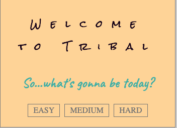
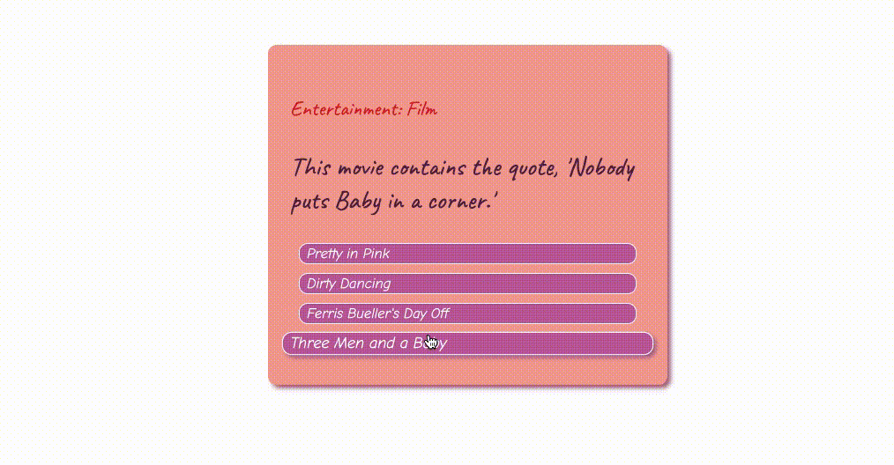

Welcome to tribal

https://gustylocuras.github.io

Tribal is a trivia game that implements:
  1. AJAX request to https://opentdb.com/, a free open trivia database.
  2. Javascript logic and JQuery DOM manipulation
  3. CSS styling and animations
  4. HTML basic structure

 On page load:
 The user is welcomed to Tribal and is given the option to select the difficulty of the questions (easy, medium, hard)
 Once the option is selected, the modal goes away and the game starts with the first question being displayed.

 

 The code:
 1. Creates a global variable to shuffle the answers before displaying them.
 2. Runs a start() function that:
    - empties previous questions within the question container (in case of reset)
    - declares a token variable used to pass the session token to the data request (first empty and then assigned by the first AJAX request)
    - declares a difficulty variable, first empty, then assigned by on'click' in the welcome modal.
    - the same on'click' runs the second AJAX request with difficulty and token provided (this request gets 10 questions)
    - each of the components of the question box is extracted from the data pool,
      incorrect answers are pulled out of an array and pushed into the shuffle array with the correct answer as well. After that a splice method is used to extract a random index from the shuffle and add it to the question box.
    - there are two tipes of questions, boolean and multiple choice, so a conditional statement had to be used to work them in different ways.
    - Once an answer is clicked a time-out function is run to switch automatically to display the next one and hide the rest like a sort of carousel but triggered in one direction only.
  3. The styling was definitely the learning point of this project. I took the time to learn more about animations and how to apply them in different ways.

   
